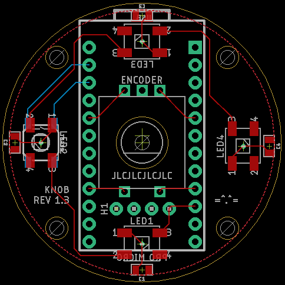

# knob

A simple volume knob with underglow. An experiment in using multiple PCBs for structure and functionality a-la 40percent.club.

## Bill of materials

### Basics

- 2x PCBs
- 1x pro-micro or compatible controller
- 1x 6mm EC11-style encoder with switch
    - The largest diameter of the shaft should be 7mm for PCB compatibility
- 1x 40mm knob (the RS Pro knobs are just the right size)
- 4x 100nF 0805 capacitors
- 4x 5050 WS2811 LEDs
- 1x 4-pin male and female header
- 4x M2 or M3 standoffs
- 8x bolts for the standoffs
- 4x adhesive rubber feet
- 1x SMD momentary switch

## Assembly

### Top PCB

Solder the four LEDs, the four SMD capacitors, on the top side of the board. Solder one side of the four-pin header to the opposite side.

### Bottom PCB

Solder the encoder to the top side of the board. Solder the reset switch to the bottom side. Either solder or socket the controller to the bottom side. Test-fit the header with the standoffs to make sure it makes contact with the top PCB before soldering to the same side as the encoder.

### Standoffs

Now simply screw the PCBs together, making sure the 4-pin header is mated in the middle. Attach your rubber feet to the bottom, and mount the knob to the top.

## Functionality

The knob has three bits of built-in functionality in the stock firmware;

- Turning the knob acts as a volume control
- Pressing the knob acts as a play/pause button
- Long-pressing the knob toggles the LEDs

## Schematic

[High-res schematic](./screenshot/schematic-hi.png)
